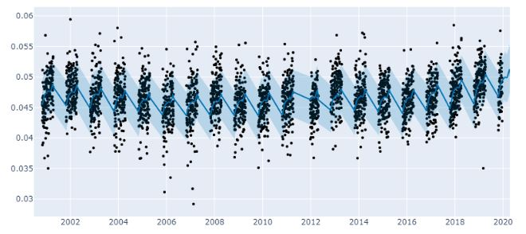
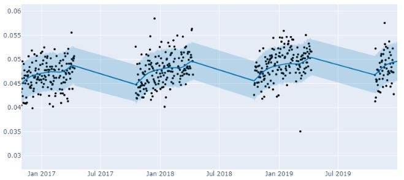
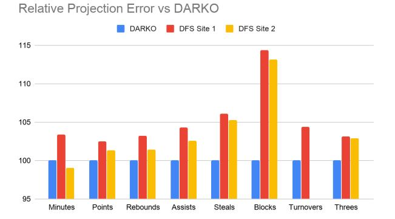

***

**DARKO: [Kostya Medvedovsky](https://twitter.com/kmedved)** || **Application: [Andrew Patton](https://twitter.com/anpatt7)**

[$ Support DARKO $](https://www.buymeacoffee.com/darko)

***

# What Is DARKO?

**DARKO is a machine learning-driven basketball player box-score score projection system.**

[For an audio primer check out Kostya on Seth Partnow's show here.](callin.com/link/jyShrOvLtk)

The public basketball stats space has advanced wonderfully over the last decade, most prominently with explosion of “all-in-one” metrics like [RAPM](http://nbashotcharts.com/rapm?id=1109440799), [RPM](http://www.espn.com/nba/statistics/rpm), PIPM (RIP), [LEBRON](https://www.bball-index.com/lebron-introduction/), and [BPM](https://www.basketball-reference.com/about/bpm.html), among others. Excellent research has also been done on a number of other topics, such as [positional versatility](https://fansided.com/2016/09/14/positional-versatility-score/), [clutch performance](http://www.apbr.org/metrics/viewtopic.php?f=2&t=8575), [shooting luck](https://thepowerrank.com/2013/10/29/3-point-defense-in-the-nba-skill-or-luck/), and [matchups](https://fansided.com/2018/04/19/nylon-calculus-nba-matchup-data-defensive-roles/).

However, despite these advances, there has been a relative dearth of focus on forward-looking projections as opposed to backwards-looking explanations, and even less public work on basic box-score metrics (as opposed to “all-in-one” metrics). [Krishna Narsu has done excellent work on the “stability” of various stats](https://fansided.com/2017/12/21/nylon-calculus-team-stats-noise-stabilization-thunder/), [and I have contributed myself](https://twitter.com/kmedved/status/1063456469511737344), but this work has been on a team level. FiveThirtyEight, meanwhile, has been releasing their [CARMELO/RAPTOR player projections](https://projects.fivethirtyeight.com/2020-nba-player-projections/), but these are likewise rolled-up, “all-in-one”-style projections that tell us relatively little about where a player’s growth/decline is going to come from. These metrics don’t answer questions such as “how good a three-point shooter is Jaylen Brown?” or “how many two-point attempts can we expect Marcus Smart to take?”

DARKO (Daily Adjusted and Regressed Kalman Optimized projections) is an attempt to fill that gap. As will be familiar to baseball fans, DARKO is a basketball projection system similar in concept to Steamer, PECOTA, and ZiPS. To my knowledge, it is one of the few public computer-driven NBA box-score projection systems (as opposed to the “hand-curated” systems offered by some fantasy basketball sites).

Further, unlike the baseball projection systems listed above (or the CARMELO/RAPTOR projections), DARKO is built from the ground up to update its projections daily, responding to new information as it comes and updating its understanding of player talent accordingly. Instead of just making a projection before the season and leaving users to guess whether a given breakout is “real” or not, DARKO updates its projections for every player in the NBA, for every box-score stat, for every day of the season.

***

## Model Summary

DARKO is built using a combination of classical statistical techniques and modern machine learning methods. DARKO is Bayesian in nature, updating its projections in response to new information, with the amount of the update varying by player and by stat, depending on DARKO’s confidence in its prior estimate. 

The inputs for DARKO are NBA box scores, tracking data, and other game-level information from [Basketball-Reference.com](https://www.basketball-reference.com/), [NBA.com](https://stats.nba.com/), and aided by [Darryl Blackport’s work in creating pbpstats.com](https://github.com/dblackrun/pbpstats). DARKO is trained on every player game log since the 2001 season (about 736,000 so far), although as discussed below, the model coefficients and fits are dynamic and respond to changes in the league environment over the last 20 years.

DARKO thus brings baseball-style projection systems to the NBA and advances them by updating on the fly in a rigorous manner. DARKO grapples with the core problem facing every fantasy player (and fan): understanding how much of a given player’s development or decline in-season reflects real talent changes, and how much is just the random noise that is part of an NBA season. 

DARKO addresses these issues without any arbitrary endpoints, i.e., without looking at the last X games of a player’s career. Arbitrary endpoints can be used to tell a misleading story, as almost every NBA player has a period during which they are “hot.” Instead, DARKO considers every NBA game a player has ever played in making its projections, weighing each game as appropriate based on recency, with the weights varying by stat being projected.

To take some examples, DARKO is well suited to answering questions such as:

* “Brandon Ingram is shooting over 40% from three in the first 25 games of the year, despite shooting 33% from three last year. What can we expect his three-point percentage to be going forward? 

* “Colin Sexton struggled last year in the aggregate, but closed the year extremely strong. How much should we weight his performance after the all-star break against his overall results in projecting him for next year?”

DARKO does this by modeling player performance via an exponential decay model, weighing each game a player has ever played by β^t, where β is some number between 0 and 1, and ‘t’ is the number of days ago a given game took place. The value of β differs for each stat, selected to best predict future results. A differential evolution optimizer is used to calculate each β. Values of β very close to 1 effectively weight each game in a player’s history equally. Smaller values of β place more weight on recent games by contrast. In practice, with a few exceptions, values of β tend to be 0.98 or higher.

To take an example, a β of 0.99 would mean that a game yesterday would have a weight of 0.99 in a player’s projection, while a game a year ago would have a weight of just 0.025 (0.99^365), meaning that games a year ago are given nearly 40 times less weight by DARKO. In other words, a β of 0.99 places strong weight on recent performance relative to historic performance (40x higher here). In baseball parlance, a β of 0.99 is a very **high** stabilization rate, with older data being almost irrelevant compared to new data. By contrast, a β of 0.9999 places almost the same weight on games yesterday (0.9999 weight) as games a year ago (0.964 weight). This would correspond to a very low stabilization rate: the stat essentially will not stabilize over the course of a full season.

This exponential decay approach is at the heart of DARKO and is what gives it its daily nature. DARKO is able to update in response to new information, weighing more recent data more heavily, without ignoring **any** data. Exponential decay is well suited to sports predictions because it is flexible enough to allow for simultaneous regression to the mean and a player’s own career averages, while recognizing that more recent performance may reflect talent changes, so may be more useful in making predictions.

DARKO also combines this exponential decay approach with a [modified Kalman filter](https://en.wikipedia.org/wiki/Kalman_filter). Kalman filters are a standard approach used in time-series analysis to model the location of an object for which only noisy measurements are available. Commonly used in fields such as robotics, aviation, rocketry, and neuroscience, it is well suited for sports analysis as well, where we have many new measurements (games) of a player’s talent, but those measurements are inherently noisy and prone to randomness on a game-by-game level. The use of Kalman filters in sports analysis, [or even basketball](https://pdfs.semanticscholar.org/6dfd/7ee77c7503ef7f7feb5654149cca53f691c3.pdf), is not new, and it helps assist DARKO’s exponential decay features in making predictions.

A [gradient boosted decision tree](https://en.wikipedia.org/wiki/Gradient_boosting#Algorithm) is used to combine the decay and Kalman projections.

DARKO is also accounts for several sports statistics phenomena. These include:

* **Rest/Travel/Home Court Effects:** As is widely known, players perform worse on the road or on the second night of a back-to-back. DARKO accounts for these effects, again on a component-by-component level. DARKO goes to great lengths not to over- or underfit these effects, and the adjustments for these rest/travel/home court effects themselves update daily in response to new information, thus accounting for changes in overall league environment as the season progresses (e.g., as was well documented, home court advantage has been [decreasing in the NBA for some time](http://harvardsportsanalysis.org/2017/03/nba-home-court-advantage-is-in-decline-are-3s-to-blame/)).

* **Opponent Adjustments: ** Similar to rest/travel/home court effects, DARKO’s projections account for who each team is playing on a given night, accounting for the projected influence of a player’s opponents on each individual stat.

* **Aging:** DARKO includes an aging curve. Because players improve differently with age in different stats, DARKO uses an independent aging curve for every stat it projects. For example, players display less improvement in block rate than they do in turnovers, so DARKO’s projected improvements for young players’ block rates will be proportionately less. 
Because DARKO updates on a daily basis, these aging effects have a small effect on a day-to-day level, but a bigger impact during the offseason and in the aggregate over the course of a season. DARKO also attempts to account for the selection biases which make [aging studies very difficult to carry out in sports data](http://blog.philbirnbaum.com/2019/11/why-you-cant-calculate-aging.html).

* **Seasonality:** Throughout the NBA, offensive efficiency to start the season is usually relatively low league-wide and increases throughout the year. This applies to essentially every element of offense. Turnovers are high. Shooting percentages are low. Assist rates are low. Here's a chart of league average assists per 100 possessions over the last 19 years. Black dots represent individual days of the season, and the blue line represents the trend. The flat blue lines between clusters are the offseason during which there is no data.

And here is a zoom-in on the last few seasons. The blue line is the trend. As you can see, within each season, the trend is for two-point field goal percentage to rise:

DARKO even accounts for a temporary flattening of the rise in assist rates (and other offensive metrics) around the all-star break. All seasonality effects are calculated separately for each component, to capture their own individual trends. Because of this seasonality, DARKO’s daily estimates of player talent change slightly on a daily basis to reflect DARKO’s understanding of league-wide environmental changes.

* **Interaction Effects:** DARKO accounts for interactions between various box-score components in making its projections. For example, if a player improves both his three-point shooting and his free throw shooting simultaneously, DARKO will be inherently more credulous of such an improvement than if the player improved their performance in just one stat or the other. See below a chart showing the projected three-point shooting of Brandon Ingram, Justise Winslow, and Caris LeVert:

DARKO believes relatively strongly in the Ingram breakout, despite the relatively small sample size (and the extremely noisy nature of three-point shooting), because it is paired with a dramatic increase in free throw shooting, and DARKO understands that these two stats are strongly correlated. By contrast, DARKO was much more skeptical of both Caris LeVert and Justise Winslow, who both had periods of hot shooting from three, but without the same broad-base improvement as Ingram.

* **Free Agency:** Changing teams has a big impact on some box-score components, and DARKO accounts for that. DARKO also gets less confident in its understanding of a player’s talent when they change teams, meaning DARKO effectively increases its “learning rate” after a player changes teams, updating its talent estimates more quickly in response to new data for these players.

***

## Accuracy

Now for the results. While DARKO is not intended to be a DFS tool, given the dearth of other projection systems out there for the NBA, a natural place to test DARKO was to compare how DARKO performs against DFS projections. I collected two years of daily projections from two sites selling DFS projections and converted DARKO’s rate projections to game-level projections. I tested DARKO against these sites in projecting minutes, points, rebounds, assists, blocks, turnovers, and threes made. As you can see, with one exception, DARKO beat both sites in every stat tested, some by substantial margins:

Scores represent % of DARKO’s mean absolute error per player-game for 2018-2019 games. Lower scores are better, representing a lower mean absolute error. One site did not provide turnovers data. 

The only stat where DARKO lost was in minutes projections against “DFS Site 2.” Predictably, playing-time projections are the hardest part of any projection system, and DARKO is no different in this respect. The daily nature of projections makes this especially challenging, as DARKO is not scanning news headlines regarding announced lineup changes (though it does have access to injury reports). A combination of DARKO and human review is likely to outperform simply DARKO in projecting minutes.

I have chosen not to disclose the sites I tested against, because I think both sites do excellent work in the DFS space, and one of the sites was kind enough to provide me with their own projections for testing purposes. Rather, the purpose of these comparisons was to get a baseline projection and to test how the DARKO projections perform in a real-world scenario. As a reminder, DARKO is not intended to be a DFS tool, and there are many aspects of DFS-specific strategy it does not even begin to account for.

While DARKO performs well relative to existing projection methods, it is not perfect. As shown above, it improves on two DFS-driven sites by 5-15% on most stats. It’s worth putting this sort of improvement into perspective. This is the difference between a mean absolute error of 4 points per game and 4.3 per points per game. In other words, while DARKO is an improvement upon existing tools, it is not a panacea.

One question I have been asked is “why do all this work; can’t I just look at the last 20 games of a player’s career?”. The answer, in short, is that the best window size to look at for a given stat will vary, and will be much more than 20 games for something like three point shooting, while somewhat less than 20 games for something like three point attempt rate (or minutes). Further, even within such windows, there will be improvement and decline that can be captured, that will be missed by looking at a static window size. Further, a simple “last X games” type analysis will omit all the context adjustments and interaction effects that DARKO adds.

***

## Daily Plus Minus (DPM)

While DARKO is at its core a box-score projection system, it can also be used to generate plus-minus projections, similar in nature to RPM, PIPM, etc. I have called this metric DPM, for “Daily Plus Minus.” This metric provides an estimate of how much DARKO thinks each player impacts the score of a game. Daily Plus Minus is available in two flavors. A box-score-only version (Box DPM), which combines the core box-score metrics to predict player value, and another set (DPM) which adds in on-off data to do the same.

Both DPM and Box DPM remains works in progress and may change substantially going forward.

***

## Rookies

DARKO presently has no NCAA, summer league, or preseason data in it. That means rookies are all initialized to essentially the same starting point (with some differences for age), and then DARKO ‘learns’ about them as they play. Critically, that means that DARKO doesn’t know anything about a rookie like Zion Williamson, who has yet to play, and cannot yet effectively distinguish him from other rookies who have yet to play. Once Zion returns from injury, DARKO will learn about his skillset quickly.

NCAA, summer league, and preseason data fits in smoothly in the DARKO framework and will be added for the 2021 season to address this issue. This will also have the benefit of improving projections for veterans as well.

***

## Further Improvements

DARKO is currently calibrated to generate projections for each player for the next day of the season. The framework is extendable to other types of projections as well, however, such as season-long projections or upside/peak projections. This functionality will be rolled out in the coming months, along with several other improvements, including adding more tracking data, biometric data, and G-League data into the model. Each of these should help improve model accuracy further.

***

***

## Acknowledgments

Thanks to almost everyone on NBA twitter for help with DARKO’s development, but I wanted to call out a few individuals who have been invaluable in DARKO’s development in particular. Thanks to [Dan Rosenheck](https://twitter.com/DanRosenheck), [Nathan Walker](https://twitter.com/bbstats), [TangoTiger](https://twitter.com/tangotiger) for inspiration in the design of DARKO, and assistance with the underlying math. Thanks to [Andrew Patton](https://twitter.com/anpatt7) for building this application. Thanks to [Ryan Davis](https://twitter.com/rd11490) for extensive coding assistance, and in particular code optimization [(numba forever)](http://numba.pydata.org/), and to [Canzhi Ye](https://twitter.com/canzhiye) for scraping assistance. Thanks to [Eric Westlund](http://@EricEsq503) and [Mike Lehrman](https://twitter.com/mlermo) for additional design discussions and editing this narrative. Thanks for [Krishna Narsu](https://twitter.com/knarsu3) for providing much of the training data used by DARKO. Thanks to [Nate Solon](https://twitter.com/natesolon) for help researching time-series analysis techniques generally. 

Special thanks to [Seth Partnow](https://twitter.com/SethPartnow) for making sure I didn’t just spend all this time building yet-another-all-in-one-stat. And thanks to [Crow](https://twitter.com/bballstrategy) for making me build one anyway.

***

